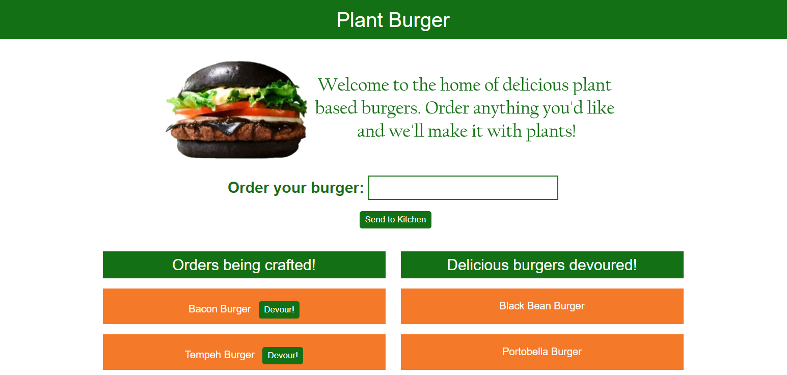
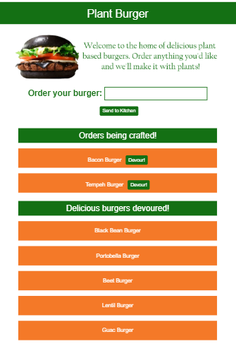

# Plant Burger 

## Description

This is a restaurant app created using MySQL, Node, Express, Handlebars and an ORM. It follows the conventional MVC design structure. It is deployed to Heroku and you can see it here: <https://radiant-meadow-34570.herokuapp.com/> . You can also see it in my portfolio here: <https://melindawinter.github.io/portfolio/portfolio.html>

## Table of Contents

- [Installation](#installation)
- [Usage](#usage)
- [Technologies](#technologies)
- [License](#license)
- [Contributing](#contributing)
- [Questions](#questions)
- [Credits](#credits)

## Installation

You can simply visit the site linked to above to use this app. If you would like to adapt it, please clone my repo. Make sure you have node.js installed on your computer. You can find the download here <https://nodejs.org/en/download/>. Run npm install to install all dependencies.

## Usage

This app is intended for the management of a burger restaurant or stand. Type in the name of any burger you would enjoy eating and click "Send to Kitchen." Once the burger appears, click the Devour button and it will be sent to the devoured column.

## Technologies

HTML, CSS, Bootstrap, JavaScript, jQuery, AJAX, APIs, Node, Express, Handlebars, MySQL, Heroku

## License

GNU General Public License v3.0

The GNU License allows the software to be modified and distributed by other users. It does not impose any restrictions on the use of the software but requires that it remain open source.

## Contributing

Please contribute to this project if you feel that you can make the code more efficient or if you'd like to add more questions for the user. Create your own branch from the Master and submit a pull request. I ask that you follow the Contributor Covenant code of conduct: <https://www.contributor-covenant.org/version/2/0/code_of_conduct/code_of_conduct.md> 

## Questions

- [Github Profile](https://github.com/melindawinter)
- melindawinter42@gmail.com
- Please email me or connect with me on Linked In: <http://www.linkedin.com/in/melinda-winter-34a25689>.

## Credits

Thank you to my team members Cyrus Jose and Kevin Cabe for helping me get this app working. Thanks to Jeanette Hernandez for a pep talk, ideas for getting started, helping me set up the Heroku connection, and for her general awesomeness.
